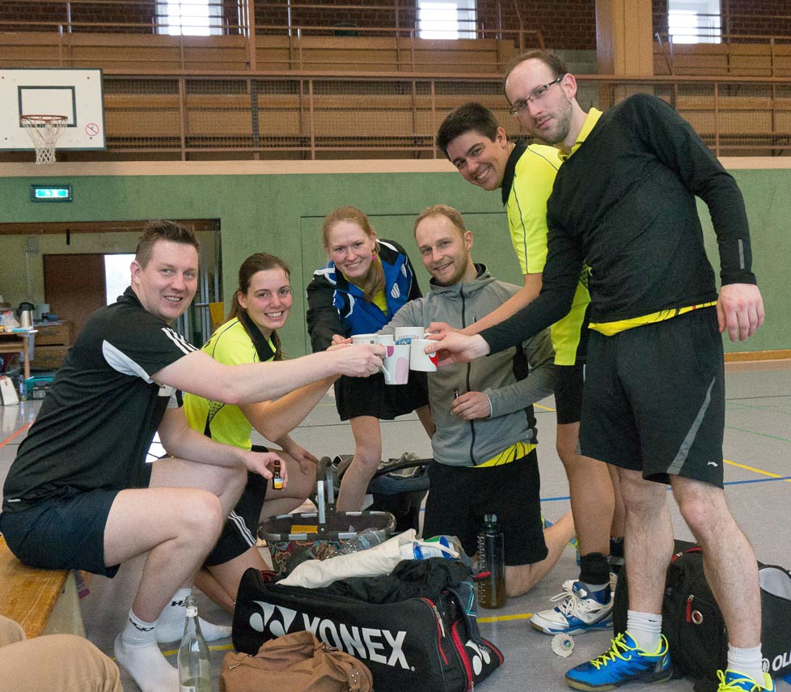

# VT Rinteln 1 dominiert die Bezirksklasse Hannover

Nach einem sieg gegen den Tabellenzweiten ist der Aufstieg in die Bezirksliga vorzeitig gesichert.

Nachdem die Badmintonsparte der VT Rinteln vergangenes Jahr die Landesligamannschaft aufgrund einiger Spielerabgänge auflösen musste, spielt die erste Mannschaft  die Saison 2016/2017 in der Bezirksklasse Hannover. In der Stammbesetzung Sven Aits, Björn Eilert, Fabian Korte, Stephan Rinne, Tabea Korte und Angelina Kutscher spielen die Badmintonasse der VT Rinteln eine furiose Saison. Bereits nach einigen Spieltagen hatte sich die Mannschaft einen guten Vorsprung auf die Verfolger in der Tabelle erkämpft. Nun galt es am vergangenen Spieltag die vorzeitige Meisterschaft und den damit verbundenen Aufstieg in die Bezirksliga zu sichern.

Gegen den Tabellenzweiten SG Lehrte/Sehnde/Goltern musste ein Sieg her. Gesagt, getan. Die Herrendoppel gingen allesamt deutlich an die Weserstädter. Lediglich Olga Koczewski und Tabea Korte mussten sich ihren Gegnerinnen knapp geschlagen geben. Durch ihre Doppelerfolge beflügelt starteten Sven Aits, Björn Eilert und Stephan Rinne im Anschluss in ihre Einzelpartien. Die drei Matches waren hart umkämpft und gingen alle nach Verlängerung bzw. erst im Entscheidungssatz an die VTR. Mit dem Sieg im Mixed setzten Fabian und Tabea Korte einen glänzenden Schlusspunkt unter die Partie, die am Ende 6:2 von der VTR gewonnen wurde.

Obwohl dieser Sieg bereits zur Meisterschaft reichte, wollten die Rintelner auch die zweite Begegnung des Tages gegen den SV Harkenbleck gewinnen. Mit einem 8:0 Sieg gegen eher schwache Gegner läuteten die sechs VTRler die Meisterschaftsparty ein. Einen Spieltag vor Saisonende steht die VT Rinteln als Meister und Aufsteiger fest. Glückwunsch, eine krachende Aufstiegsparty und gut Schlag nächstes Jahr in der Bezirksliga wünschen wir euch!
