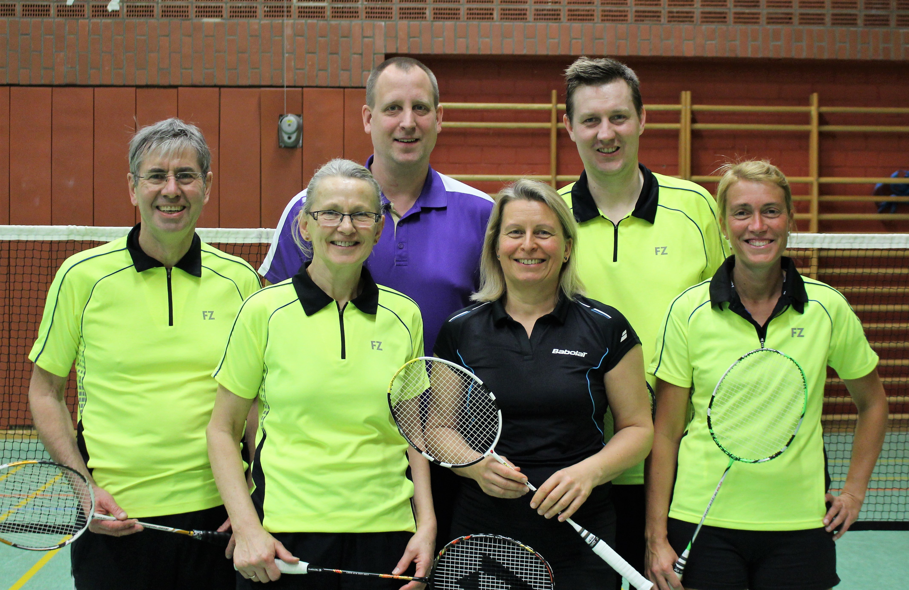

# Walter Westermann und Walter Beißner zweifache Landesmeister

Bei den Landesmeisterschaften der Altersklassen O35 bis O65 traten am vergangenen Wochenende zahlreiche Schaumburger Badmintonasse an.

Mit hoch gesteckten Zielen reisten Sven Aits, Stefanie Battefeld, Walter und Doris Westermann (alle VT Rinten), sowie Walter Beißner und Angelika Peddinghaus (beide Bad Eilsen) nach Laatzen zum VfL Grasdorf.

Im gemischten Doppel der über 35 Jährigen gingen Sven Aits und Stefanie Battefeld an den Start. In einem schweren Auftaktmatch hatten Aits/Battefeld Mühe sich ins Turnier zu kämpfen. Nach überstandener Vorrunde war für die beiden Rintelner im Halbfinale Schluss. Dennoch freuten sich beide am Ende über Platz 4 und die Qualifikation zur Norddeutschen Meisterschaft.

Den Sprung auf das Podest schafften Walter und Doris Westermann in der Altersklasse O60. In einer Vierergruppe konnten die beiden ein Spiel für sich entscheiden und belegten einen guten dritten Platz. Noch besser verlief das Turnier für Walter Beißner und Angelika Peddinghaus. Nach drei gewonnenen Gruppenspielen freuten sich die beiden Eilsener über die Meisterschaft im gemischten Doppel O60.

Spielerisch nicht ganz so erfolgreich verlief das Damendoppel für Angelika Peddinghaus. An der Seite von Doris Westermann ging die Finalpartie gegen Frahm/Graef verloren. Doch auch eine Silbermedaille zauberte ein Lächeln auf die Gesichter der Schaumburger Damen.

Etwas härter mussten sich Stefanie Battefeld und ihre Doppelpartnerin Jennifer Thiele die Silbermedaille erkämpfen. In einem starken Starterfeld mussten sich Thiele/Battefeld lediglich den späteren Siegern Beke Recht und Janine Hentschel mit 17:21 und 17:21 geschlagen geben.

Im Herrendoppel begann dann auch der Siegerzug für Walter Westermann bei den diesjährigen Meisterschaften. An der Seite seines langjährigen Doppelpartners Walter Beißner, spielte sich Westermann problemlos ins Finale. Dort erwartete die beiden Schaumburger die Paarung Flemming/Hagedorn. Durch einen nie gefährdeten Zweisatzsieg konnten Westermann/Beißner ihren Sieg bei den Landesmeisterschaften feiern.

Nachdem sich sein Doppelpartner Walter Beißner zwei Titel geschnappt hatte, wollte Walter Westermann mit einem Sieg im Herreneinzel nachziehen. Und dieses sollte tatsächlich gelingen. Durch mühelose Siege in der Vorrunde zog Walter Westermann ins Finale gegen Heinz-Dietmar Schmidt ein. In einer kräftezehrenden Partie behielt Westermann am Ende die Nerven und gewann mit 22:20, 20:22 und 22:20. Walter Beißner sicherte sich im Herreneinzel einen guten dritten Platz.

Sehr zufrieden und mit reichlich Medaillen behängt kehren die Badmintonspieler heim und bereiten sich nun intensiv auf die Norddeutschen Meisterschaften im April vor. Wir wünschen bereits jetzt „Gut Schlag“.
