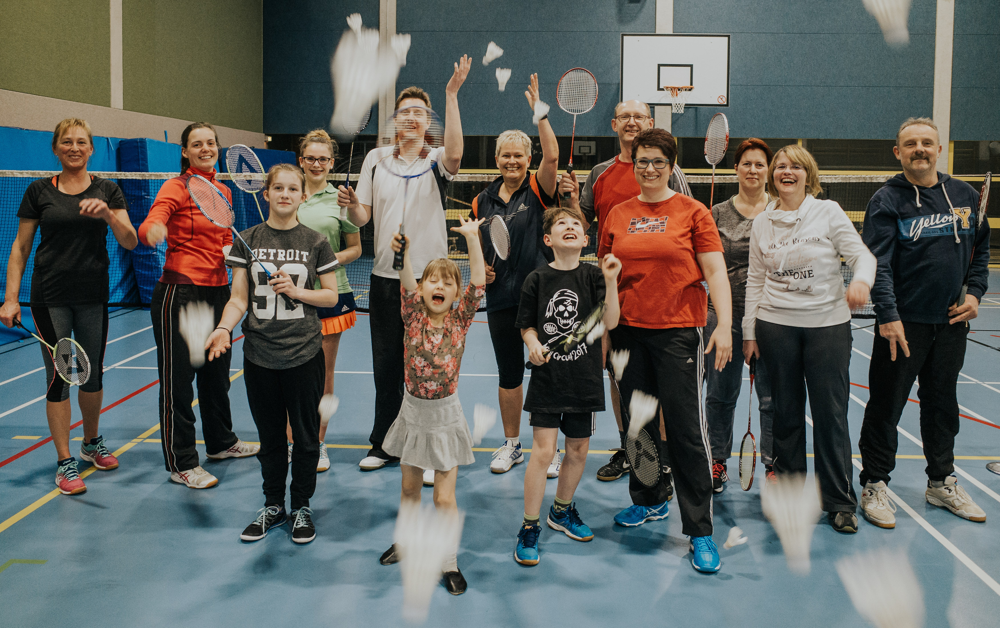

# Anfängerkurs für Familien

Vier Familien, viele Badmintonbälle und eine Menge Spaß.

Ein Kurs für Familien und Partner sollte Spaß am gemeinsamen Sport treiben und viel gute Laune bringen. Unter dieser Prämisse lud die Badmintonsparte der VTR Interessierte Familien in die Sporthalle ein um einen Anfängerkurs zu machen.

Vier Familien gingen im März an den Start und testeten ihre koordinativen Fähigkeiten.

Unter der Leitung von Sven Aits, Tabea Korte und Stefanie Schrader erlernten die Hobbysportler die richtige Schlagtechnik für Clear, Drop und den Schmetterball - auch Smash genannt. Vor allem die Kinder im Alter von 5 bis 17 Jahren zeigten sich sehr talentiert und versuchten schnell die „Großen“ zu schlagen.

Nach einem gemeinsamen Aufwärmen wurden einige Technikübungen gemacht, bevor alle ihr Erlerntes im freien Spiel ausprobieren konnten.

Der Kurs war ein tolles Erlebnis für alle Beteiligten und hat Lust auf mehrere Erfahrungen dieser Art gemacht. 

Auch Lust auf Badminton bekommen? Wir trainieren montags von 19:00 bis 21:30 Uhr und freitags von 19:30 bis 21:30 Uhr in der Kreissporthalle Rinteln. Schüler und Jugendtraining ist mittwochs von 18:00 bis 20:00 Uhr.

An dieser Stelle nochmals großen Dank an alle fleißigen Hobbysportler und bis hoffentlich bald einmal wieder in der Badmintonhalle.
