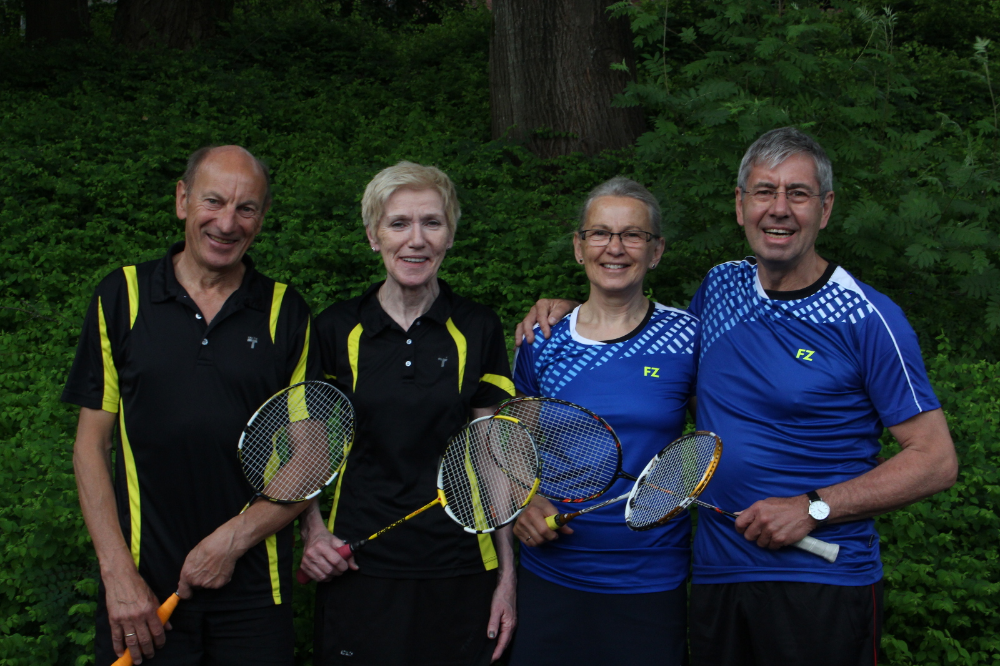

# Schaumburger erreichen Viertelfinale bei Deutschen Meisterschaften

Der Höhepunkt der Saison wartete am vergangenen Wochenende in Solingen auf die Badmintonsenioren der Republik.

Die Deutschen Meisterschaften der Altersklassen ab 35 Jahren versprechen erstklassige Badmintonspiele.

Aus dem Kreis Schaumburg qualifizierten sich dieses Jahr Walter Beißner, Angelika Peddinghaus (beide Bad Eilsen), Walter Westermann, Doris Westermann (beide VT Rinteln) und Christoph Schröder (Germania Hohnhorst). 

In der Altersklasse O40 trat Christoph Schröder an. Im Herreneinzel endete das Turnier für ihn leider bereits in Runde 1. Im anschließenden Herrendoppel sollte es wesentlich besser laufen. An der Seite seines langjährigen Doppelpartners Patrick Bethe spielte sich der Hohnhorster problemlos durch die Vorrunde. Im Viertel- und Halbfinale mussten Schröder/Bethe ihr ganzes Können zeigen und schafften durch zwei hart umkämpfte 3-Satz Siege den Einzug ins Finale. Den Meistertitel verpasste das Duo leider und musste sich im Endspiel den Favoriten deutlich in zwei Sätzen geschlagen geben.

In der Altersklasse O 60 gingen gleich 4 Schaumburger Badminton-Asse an den Start.

Im Herreneinzel erwischte Walter Westermann einen unglücklichen Start in das Turnier. Er schied bereits in Runde 1 gegen Jürgen Becker aus Neuwied aus.  Ein bisschen Nervosität und viele vermeidbare Fehler verhinderten ein Weiterkommen für den Rintelner.

Besser verlief das Turnier für Walter Westermann in den Doppeldisziplinen. Mit seinem Doppelpartner Walter Beißner aus Bad Eilsen gewann er das Erstrundenspiel deutlich in zwei Sätzen. Im Viertelfinale erwartete die beiden „Walters“ jedoch der Topfavorit auf den Turniersieg. An der Paarung Budczinski/Handschuhmacher war für die beiden Schaumburger an diesem Wochenende kein Vorbeikommen.

Sehr ähnlich erging es den Schaumburger Badmintondamen im Doppel. Angelika Peddinghaus und Doris Westermann erreichten ebenfalls das Viertelfinale. Ihr Erstrundenspiel entwickelte sich zu einer nervenaufreibenden Partie. Mit viel Kampfgeist schafften Peddinghaus/Westermann einen Dreisatzsieg in ihrem Auftaktmatch und gewannen 17:21, 21:14 und 21:10 gegen Angelika Niesner und Christine Schwöd. Im Viertelfinale hatten dann allerdings die Gegnerinnen der beiden ein Quäntchen mehr Glück. Die beiden Schaumburgerinnen verloren unglücklich nach Verlängerung, waren jedoch trotzdem mit ihrer Leistung sehr zufrieden.

Für das abschließende gemischte Doppel heißt es im Schaumburger Land Partnertausch. Im Mixed gingen Walter Beißner und Angelika Peddinghaus, sowie Walter und Doris Westermann gemeinsam an den Start.

Für die Schaumburger Badmintonspieler war es das Wochenende der Viertelfinals. Wie bereits im Damen- und Herrendoppel, spielten sich beide Paarungen problemlos durch die erste Runde des Turniers. In der Runde der besten Acht trafen die beiden Mixed-Duos jedoch auf den späteren Deutschen Meister bzw. den späteren Vizemeister.

Walter Beißner und Angelika Peddinghaus unterlagen Ulrich Handschuhmachen und Birgit Holtmann klar in zwei Sätzen. Auch Walter und Doris Westermann und verloren ihr Viertelfinalspiel deutlich mit 16:21 und 11:21 gegen Manfred Rössler und Marie-Luise Schulta-Jansen.

Das Fazit des Wochenendes: Viele gute Spiele gehabt, alte Bekannte getroffen und einen Vizemeistertitel ins Schaumburger Land geholt. Glückwunsch an alle für Ihre tollen Leistungen!
