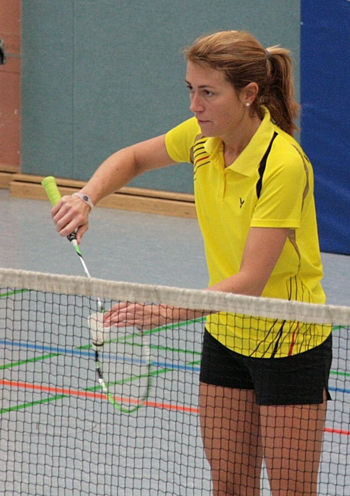

# Stefanie Battefeld im Halbfinale bei Niedersachsenrangliste

In Schüttdorf fand die erste Niedersachsenrangliste des Jahres statt. Für die VT Rinteln ging Stefanie Battefeld mit Ihrer Doppelpartnerin Jennifer Thiele an den Start.

Durch starke Leistungen in der Vergangenheit durfte das Doppel auf Setzplatz 2 in das Turnier gehen. In einer Vorrundenpartie gewannen Battefeld/Thiele mit 21:16 und 21:7 überlegen gegen Meldau/Frost. 

Im Halbfinale spielte das Damendoppel gegen die an drei gesetzte Paarung Borchard/Bolle. Es entwickelte sich eine knappe Partie mit hart umkämpften Ballwechseln. Den ersten Satz verloren Battefeld/Thiele knapp mit 12:21. Der zweite Satz sollte noch nervenaufreibender werden. Doch auch hier behielt die gegnerische Paarung am Ende die Oberhand und zog mit 21:19 ins Finale ein.

Nach dieser kraftraubenden Partie spielte Stefanie Battefeld mit Jennifer Thiele im kleinen Finale um die Bronzemedaille. Doch auch hier hatten die Gegner am Ende ein bisschen mehr Glück und so belegten Stefanie Battefeld und Jennifer Thiele einen tollen vierten Platz.
