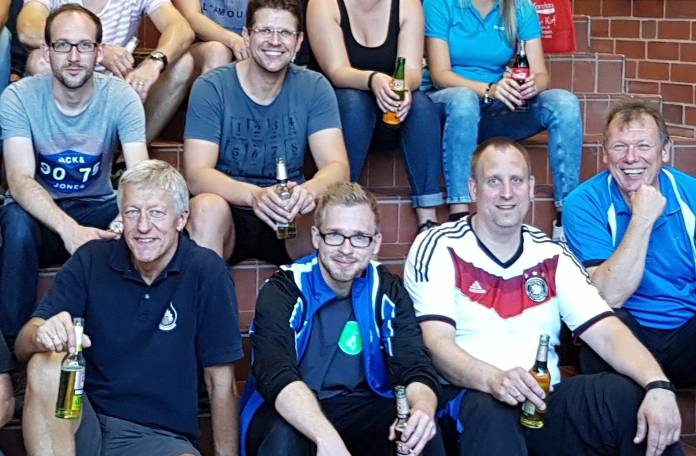

# 280 Teilnehmer aus ganz Deutschland bei Rintelner Pokalturnier am Start

Zum bereits 37. Rintelner Pokalturnier begrüßte die Badmintonsparte der VT Rinteln Aktive aus allen Teilen Deutschlands.

In vier Leistungsklassen gehen Sportler aus dem Hobbybereich bis hin zu Regionalligaspielern an den Start. Bei rund 280 Teilnehmern hatte das Organisationsteam um Sven Aits ca. 600 Spiele am Wochenende auf dem Spielplan. Und diese Spiele hatten es dieses Jahr in sich. Teils hart umkämpfte 3 Satz Matches zögerten den Turnierverlauf leicht hinaus, was das hervorragend eingespielte Turnierleitungsteam jedoch kurzfristig kompensieren konnte. Ein solches Traditionsturnier entwickelt sich über die Jahre zu einem kleinen Familientreffen. Und so kommt es, dass auch ehemalige Rintelner den Weg zurück in die Heimat finden. Bestes Beispiel hierfür ist Andres Westermann. Der gebürtige Rintelner lebt und trainiert seit einiger Zeit in Köln und nutze das Rintelner Pokalturnier für einen Heimatbesuch. In der höchsten Spielklasse kämpfte sich Andres souverän durch die Vorrunde im Herreneinzel. Ein packendes Match entwickelte sich zwischen Westermann und Wolf-Dieter Papendorf. Die beiden alten Bekannten aus Jugendtagen zeigten den begeisterten Zuschauern wie reaktionsschnell ein Topspieler sein muss und wie nervenaufreibend dieser Sport sein kann. Das bessere Ende hatte Andres Westermann für sich, der die Halbfinalpartie in der Verlängerung des dritten Satzes für sich entscheiden konnte.

Im Finale hatte der Rintelner jedoch keine Chance gegen den stark aufspielenden Dennis Friedenstab und war sehr zufrieden mit Platz 2.

Auch in den Doppeldisziplinen gaben die Spieler alles und nutzen das Turnier als Testlauf für die bevorstehende Saison, die in zwei Wochen für viele Vereine beginnt.

Am Sonntag Abend machten sich alle Sportler wieder auf den wohlverdienten Weg nach Hause und können sich schon auf die 38. Auflage des Badmintonklassikers freuen.

An dieser Stelle darf auch einmal erwähnt sein, dass ein solches Turnier nie ohne Helfer zu bewältigen ist. Die stillen Stars der Halle sind alle Helfer, Sponsoren und das gesamte Organisationsteam, die teils schon Wochen vorher ihre Freizeit damit verbringen 48 Stunden Turnierspaß auf die Beine zu stellen.

Die Badmintonsparte bedankt sich bei der riha WeserGold für die Getränkespende, die den Teilnehmern zur Verfügung gestellt werden konnte.
