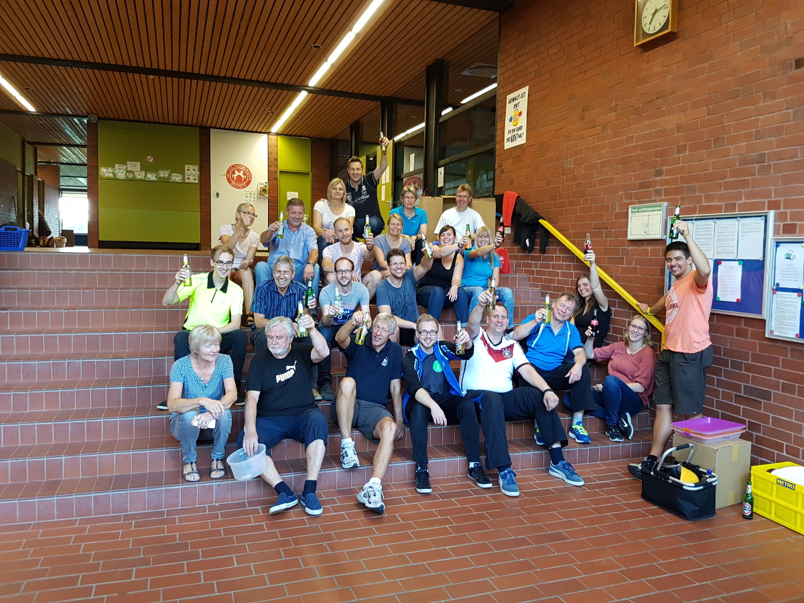

# 37. Rintelner Pokalturnier ein voller Erfolg

277 Spieler - 610 Spiele. Die Badmintonabteilung der VT Rinteln stand vor einem wahren Mammutprogramm und hat dieses bravourös gemeistert.

Neben sehenswerten Spielen gehörten auch dieses Jahr wieder die Cafeteria, der Sportartikelstand von Hansi Wochnik sowie natürlich die Players Party zu den Highlights des Rintelner Pokalturniers. Wir bedanken uns bei allen Teilnehmern und freuen uns schon auf das nächste Jahr. Das 38. Rintelner Pokalturnier wird voraussichtlich am 18./19.8.2018 stattfinden.
