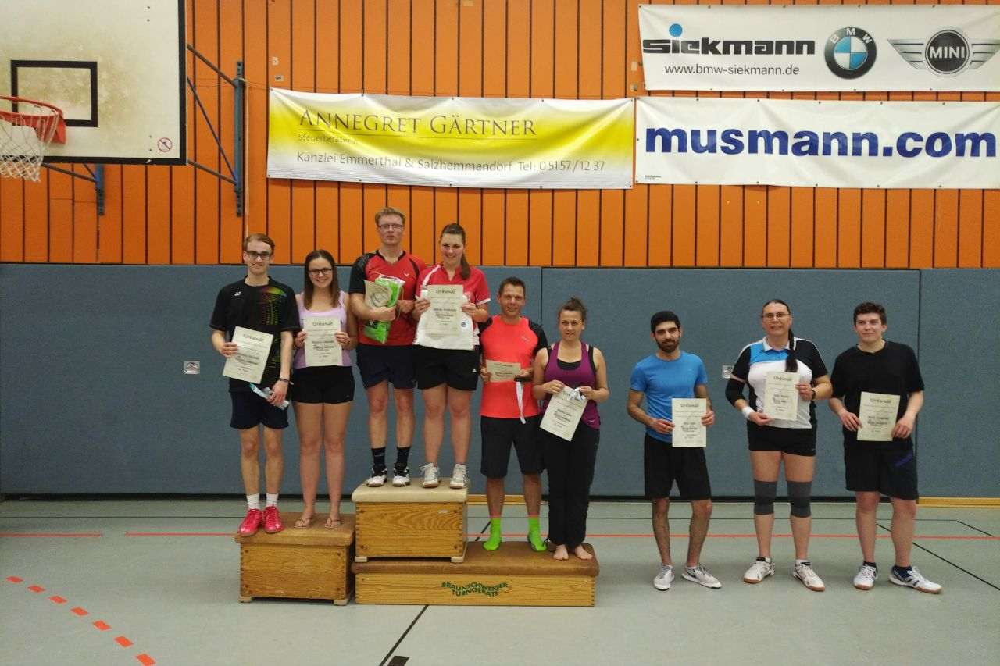

# Zwei Vizetitel für Rintelner Badmintonspieler

Bei den diesjährigen Kreismeisterschaften in Hameln fuhren die Spieler der VT Rinteln trotz guten Leistungen ohne Titel nach Hause. Am Ende holten die Aktiven zwei zweite Plätze, einen dritten Platz, einen vierten und einen fünften Platz.

Der Auftakt wurde im Gemischten Doppel C von Victoria Schneider und Dominic Kirstein gemacht. Das junge Duo, welches zum ersten Mal zusammen bei einem Turnier spielte, zeigte welches Potential in Ihnen steckt. In einer Sechsergruppe behaupteten sich die Beiden mit souveränen und kämpferischen Leistungen. Mit vier Siegen und einer Niederlage sprang am Ende der Vizetitel für die Rintelner heraus.

Das Herreneinzel C-Feld wurde in zwei Vierergruppen unterteilt. In der Gruppe von Dominic Kirstein war der Halbfinaleinzug hart umkämpft. Nach einem Sieg zum Auftakt folgte ein Dreisatzspiel gegen den späteren Kreismeister Ralf Eisenhauer, welches Kirstein leider verlor. Nun ging es im direkten Duell gegen den Bückeburger Reinhard Timm um den Halbfinaleinzug. Dieses Spiel war ein echter Krimi, denn nach Satzrückstand erkämpfte sich der Rintelner noch den Sieg und gewann letztlich im dritten Satz. Im Halbfinale musste Kirstein dem Spiel Tribut zollen, unterlag hier und wurde am Ende guter Dritter. 

In einem stark besetzten Feld in der B-Klasse vertrat Stephan Rinne die VTR im Einzel. Dort sah er sich starken Gegner gegenüber. Trotz guten Ballwechseln und einigen gewonnenen Sätzen reichte es am Ende nur für Platz Fünf.

Am Sonntag wurden die Doppel ausgetragen, an denen Volker Furchbrich und Andreas Winter, sowie Dominic Kirstein und der Bückeburger Walter Beißner teilnahmen. 

Die Paarung Furchbrich/Winter startete in der C-Klasse. Aufgrund der zahlreichen Meldungen wurde in zwei Fünfergruppen gespielt. In ihrer  Gruppe verloren Furchbrich und Winter kein einziges Spiel und zogen somit als Gruppenerste in das Halbfinale ein. Dort standen sie dem Doppel Meyer/Werhahn aus Hemeringen gegenüber und zogen durch ein 21:16, 21:14 ins Finale ein. Hier unterlagen die Rintelner der Hamelner Paarung Andreas Kaletta und Ralph Höger mit 17:21 und 19:21 und wurden Zweite.

Im Herrendoppel der B-Klasse kämpften Walter Beißner und Dominic Kirstein gemeinsam um jeden Punkt. Nach umkämpften Spielen mit einem Sieg und drei Niederlagen wurde das Vater/Sohn Duo am Ende Vierter. 
