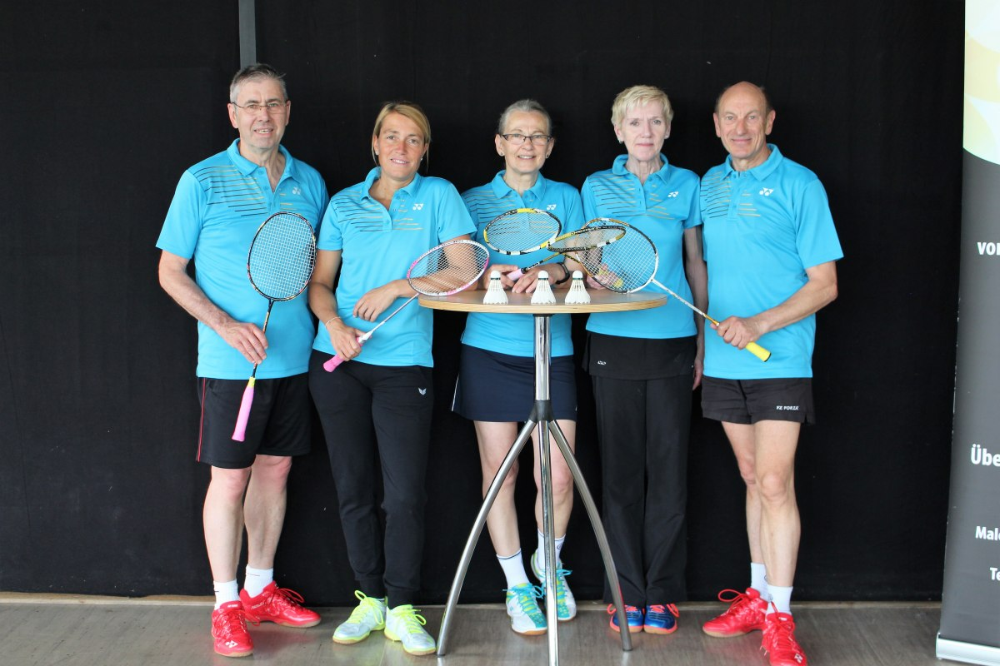

# Überzeugende Leistungen bei der Deutschen Meisterschaft O35-O75

Bei der Deutschen Meisterschaft der Altersklassen O35-O75 in Völklingen zeigten die Rintelner Badmintonspieler überzeugende Leistungen.

In der Alterklasse O40 erreichte Stefanie Battefeld an der Seite des Buxtehuders Robert Neumann überraschend das Viertelfinale. Der Achtelfinalsieg gegen die Paarung Brameyer/Menne aus NRW kostete dann aber zu viel Kraft, so dass im Viertelfinale gegen die späteren Zweitplatzierten Theisinger/Phoa Endstation war. Im Damendoppel hatte die Rintelnerin Pech mit der Auslosung. Zusammen mit ihrer Partnerin Jenny Thiele aus Grasdorf war das Turnier nach großem Kampf bereits nach der ersten Runde beendet, 16:21 und 16:21 hieß es am Ende gegen die späteren Vizemeisterinnen Menne und Schiermeyer.

In der Altersklasse O65 starteten Walter und Doris Westermann für die Weserstädter. Nach einem lockeren Auftaktsieg trafen die Rintelner im gemischten Doppel im Viertelfinale gleich auf die topgesetzte Paarung Pothmann/Regineri. Im ersten Satz waren die Westermänner immer auf Augenhöhe, verloren aber mit 20:22; Durchgang zwei verlief dann etwas deutlicher zu Ungunsten der Rintelner und nach einem 9:21 blieb am Ende Platz fünf.

Im Herreneinzel O65 hatte Walter Westermann dann ein Deja-Vu, wieder ging es im Viertelfinale nach einem umkämpften Auftaktsieg gegen den topgesetzten Pothmann. Diesmal war der Rintelner noch dichter an einer Überraschung, musste sich aber knapp mit 16:21 und 21:23 geschlagen geben.

Unnötig war laut  Westermann die Auftaktniederlage im Herrendoppel O60 an der Seite von Walter Beißner (SG Eilsen/Bückeburg). Gegen die an drei gesetzte Paarung Petche/Walther hatten die Schaumburger den ersten Satz mit 23:21 gewonnen und führten in Durchgang zwei bereits mit 19:15. Danach spielten die Nerven dann nicht mehr mit, der Satz ging noch mit 19:21 verloren und auch im Entscheidungssatz behielt der Gegner mit 21:15 die Oberhand.

Im Damendoppel O65 war das Turnier für Doris Westermann und Angelika Peddinghaus(SG Eilsen/Bückeburg) bereits nach dem ersten Spiel beendet, gegen die Paarung Braun/Kiefer hatten sie beim 13:21 und 10:21 keine Chance auf den Sieg.
