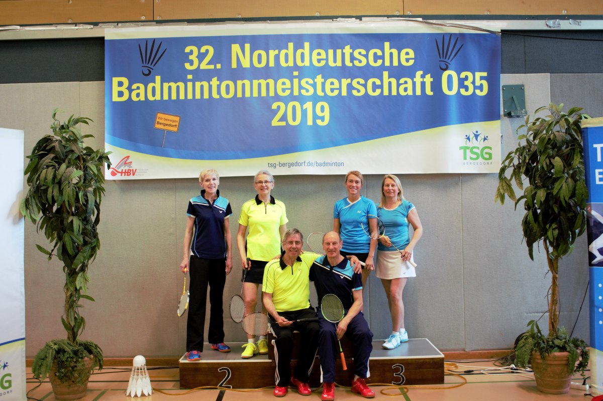

# Norddeutsche Meisterschaften O35 in HH-Bergedorf

Meistertitel für Walter Westermann, drei dritte Plätze.

Vom 05.-07.04.2019 wurden in HH-Bergedorf die Norddeutschen Meisterschaften O35 im Badminton ausgetragen. Die Spieler aus Rinteln und Bückeburg zogen eine durchaus positive Bilanz aus dem Wochenende und blicken allesamt motiviert auf die Deutschen Meisterschaften Ende Mai in Langenfeld.

Im Damendoppel O40 traten Stefanie Battefeld (VT Rinteln) und Jennifer Thiele (VfL Grasdorf) mit dem klaren Ziel der Qualifikation zur DM an. Im Viertelfinale siegten sie gegen die Tempelhofer Anne Ernst/ Nadine Schmidt 21:14, 21:23, 21:10, im anschließenden Halbfinale gegen Beke Recht/ Anne-Kristin Dreßler ( Vfl Maschen/ SV Bergstedt) mussten sie sich mit 12:21, 12:21 geschlagen geben und erreichten damit Platz 3. 
Im Mixed der Altersklasse O40 gewann Stefanie Battefeld an der Seite ihres Buxtehuder Mannschaftskollegen Robert Neumann in der ersten Runde gegen Marco Pfalzgraf/ Andrea Büchler (Möllner SV) 21:14, 21:14, scheiterten im Viertelfinale jedoch äußerst knapp und hart umkämpft  gegen Oliver Witte /Stefanie Schmidt ( Berlin) 21:18, 8:21, 19:21. 

In der Altersklasse O50 startete Bettina Krachudel (VT Rinteln) zunächst im Einzel und unterlag im Viertelfinale gegen Heike Stock (Vfl Wolfsburg) 12:21, 4:21. Im Doppel standen Bettina Krachudel und Maren Nitz (Delmenhorster FC) Seite an Seite und mussten sich in der 1. Runde der Wettberger Paarung Heike und Karen Laubvogel mit 17:21, 13:21 geschlagen geben. Im abschließenden Mixed konnte Krachudel mit ihrem Lüneburger Partner Frank Schmahl in der 1. Runde nur einen Satz gegen die starke Berliner Paarung Benno Raj/ Jana Dudek mithalten, sie unterlagen schließlich 19:21, 9:21.

Die Altersklasse O 65  wurde durch das Ehepaar Walter und Doris Westermann (VT Rinteln) sowie Walter Beißner und Angelika Peddinghaus (beide TSV Bad Eilsen) vertreten. Im Einzel schied Walter Westermann im Viertelfinale gegen Klaus Rosenkranz (TSG Bergedorf)13:21, 18:21aus. Walter Beißner dagegen fuhr klare Siege in der ersten Runde und im Viertelfinale ein. Im Halbfinale unterlag er Klaus Rosenkranz mit 25:27, 15:21 und erreichte damit Platz 3. 

Westermann/ Beißner traten im Herrendoppel gemeinsam an, siegten sowohl im Viertelfinale und Halbfinale locker und trafen in einem spannenden Finale auf die langjährigen Rivalen Adam Kulinski/ Wofgang Sonnabend (TV Cloppenburg/ SC Salzgitter Sportfreunde), das sie 21:17, 21:17 für sich entschieden und sich mit dem Meistertitel belohnten. 

Im Damendoppel waren Angelika Peddinghaus und Doris Westermann in einer Vierergruppe vertreten, nach zwei Niederlagen konnten sie das Spiel gegen Heidrun Hauser/ Helga Tews (VSG Weißenfels/ SV Grambke-Oslebshausen) 24:22, 21:15 für sich entscheiden und belegten Platz 3.

In der Mixedkonkurrenz gewannen die „Westermänner“ zunächst im Viertelfinale gegen Helmut Wiegand/ Christel Klaar (VSG Weißenfels/ TSV Spandau), im Halbfinale verloren sie gegen Wolfgang Sonnabend/ Ilona Frahm (SC Salzgitter/ BV Wolfenbüttel) mit 21:18, 11/9:21 und wurden am Ende Dritte.

Für die Paarung Walter Beißner/ Angelika Peddinghaus lief es etwas besser, sie fuhren im Viertelfinale einen klarer Sieg gegen die Hamburger Paarung Klaus Wagner/ Renate Knötzsch (21:6, 21:15). Es folgte der Halbfinalsieg gegen Bernd-Ulrich Brüsewitz/ Heide Graef (TSV Seelze/ SVC Wilhelmshaven) 17:21, 21:6, 21:19. Im Finale verloren Beißner/ Peddinghaus gegen Wolfgang Sonnabend/ Ilona Frahm 15:21, 21:23 und sind Vizemeister.