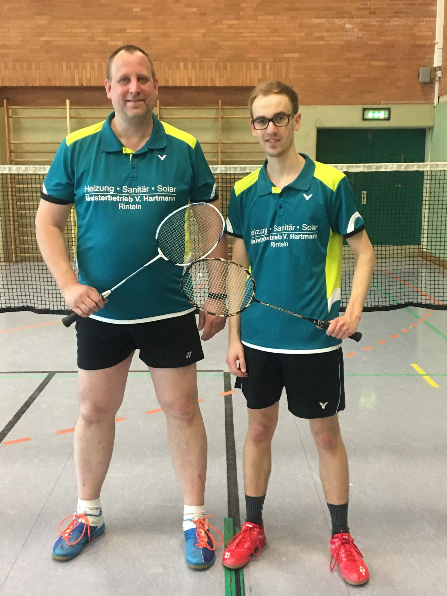

# VT Rinteln auf der Kreismeisterschaften Badminton O19 04./ 05. Mai 2019 in Bückeburg

Ein Landesmeistertitel geht nach Schaumburg, drei mal Vizemeister.

Am vergangenen Wochenende trafen sich Badmintonspieler aus den Landkreisen Schaumburg und Hameln-Pyrmont, um den Kreismeister in den Disziplinen Einzel, Doppel und Mixed zu erspielen. 

Von der VT Rinteln waren Andreas Winter im Doppel sowie Dominic Kirstein in Doppel, Mixed und Einzel vertreten.

Die ersten Kreismeister wurden im Mixed gesucht. In der D-Klasse startete Dominic Kirstein an der Seite von Sandra Pfaffe (TuS Germania Hohnhorst.  Die Paarung konnte sich in der Vorrunden-Gruppe mit zwei Siegen durchsetzen. Im Halbfinale siegten die beiden gegen Tobias Jaschke/ Stefanie Soika ( Bückeburg/ Bad Eilsen). Im Finale unterlagen Kirsten/ Pfaffe und sicherten sich somit Platz zwei hinter Thorsten Kiefer/ Rebekka Schmolke( Hilligsfeld/ Lauenau).
Im anschießenden Einzel belegte Kirstein in der D-Klasse mit Platz 3 ebenfalls einen Platz auf dem Podest.

Am Sonntag trat Kirstein an der Seite von Andreas Winter in der Doppelkonkurrenz der D-Klasse an und setzte sich mit 3 Siegen gegen die Konkurrenten durch und wurden souveräne Kreismeister. U.a. kam es dabei auch zu einem „Vater-Sohn-Duell“, denn Kirstein/ Winter siegten auch Kirstein’s Vater Walter Beißner, der an der Seite von Tobias Jaschke startete und Vizemeister wurde. 

Stefanie Battefeld
