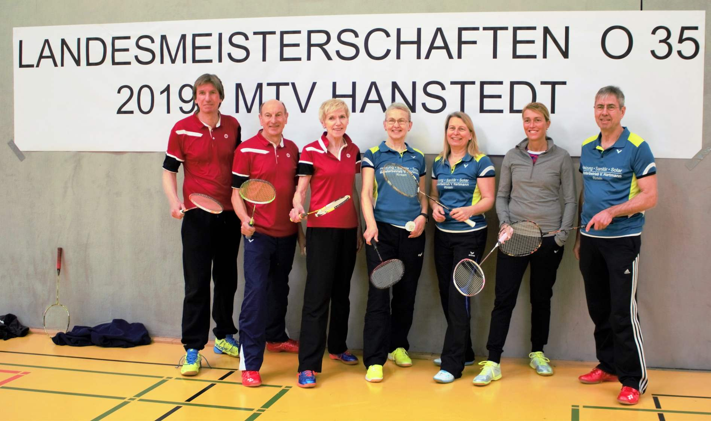

# Landesmeisterschaften Badminton O35 2019

Ein Landesmeistertitel geht nach Schaumburg, drei mal Vizemeister

Am 23./24.02.2019 wurden in Winsen/Luhe die Landesmeisterschaften der Altersklassen O35 im Badminton ausgetragen. An den Start gingen sieben Spieler/innen aus Rinteln bzw. Bückeburg.

In der Altersklasse O40 ging Stefanie Battefeld (VTRinteln) zusammen mit Ihrem Partner Robert Neumann vom Buxtehuder SV an den Start mit der Mission, den Titel aus dem vergangenen Jahr zu verteidigen. Nach einem Freilos in der ersten Runde traf das Mixed im Halbfinale auf die Paarung Patrick Beißner (TSV Bad Eilsen)/ Heike Laubvogel (TuS Wettbergen) und siegte mit 21:19,21:13. Im Finale standen den beiden die Paarung Martin Möllmann (OSC Damme)/Jennifer Thiele (BV Gifhorn) gegenüber, gegen die sie sich mit 21:14/21:16 den Landesmeistertitel sicherten. 

Im Doppel in der Altersklasse O40 war Stefanie Battefeld mit ihrer langjährigen Partnerin Jennifer Thiele am Start, das erste Spiel war ein souveräner Sieg gegen die Grasdorfer Paarung Melani Vogt/Anke Türr, das Endspiel gegen die Paarung Anja Eilers (Delmenhorst)/ Martina Götz (Grasdorf) war lange umkämpft, schließlich mussten sich Battefeld/Thiele im dritten Satz geschlagen geben und erreichen den Vizetitel.

Im Herreneinzel O40 hatte Patrick Beißner im Viertelfinale leider knapp mit 19:21,19:21 das Nachsehen gegen Ulf Speer (MTV Hanstedt).

In der Altersklasse O50 war  Bettina Krachudel (VTRinteln)  in allen drei Disziplinen vertreten. Im Dameneinzel traf Bettina im Viertelfinale auf Anke Bleich vom Ausrichter MTV Hanstedt und unterlag mit 18:21,7:21.
In der Disziplin Damendoppel stand sie mit ihrer Partnerin Maren Nitz vom Delmenhorster FC auf dem Feld und hatte nach einem Freilos in der ersten Runde im Halbfinale Averbeck/Grotelöschen (Großenkneten) vor sich, denen sie mit 20:22,10:21 Unterlagen und somit Platz der belegten. 

Im gemischten Doppel musste Bettina mit dem Lüneburger Partner Frank Schmahl im Viertelfinale eine 18:21,13:21- Niederlage gegen die Paarung Mense/ Grotelüschen einstecken. 

Walter Westermann war mit seiner Frau Doris in der Altersklasse O65 angetreten, ebenso die Paarung Walter Beißner/ Angelika Peddinghaus (TSV Bad Eilsen). Im Mixed wurden Beißner/Peddinghaus 2., sie mussten sich lediglich der Paarung Wolfgang Sonnabend/ Ilona Frahm (Sc Salzgitter/ VfL Wolfenbüttel) mit 21:16,15:21,20:22 geschlagen geben. Den 3. Platz belegten Walter und Doris Westermann. Im Herrendoppel standen Westermann und Beißner Seite an Seite und erkämpften sich Platz 2. Im Finale unterlagen Sie dem Doppel Adam Kulinski/ Wolfgang Sonnabend (TV Cloppenburg/ SC Salzgitter) knapp mit  21:16,13:21,16:21. 

Im Herrendoppel lief es für Walter Beißner besser gegen den alten Konkurrenten Wolfgang Sonnabend, Beißner setzte sich im Halbfinale mit 21:9, 21:11 durch, unterlag leider im Finale gegen Udo Spähn vom Delmenhorster FC 11:21, 19:21. Udo Spähn hatte Walter Westermann zuvor im zweiten Halbfinale geschlagen, der somit Platz 3 erreichte. 

Das Damendoppel Westermann, Peddinghaus konnte leider beide Gruppenspiele nicht für sich entscheiden, am Ende Platz 3.
Stefanie Battefeld, Bettina Krachudel, Walter und Doris Westermann, Angelika Peddinghaus sowie Walter Beißner haben sich durch ihre Siege bzw, Platzierungen für die Norddeutschen  Meisterschafen Anfang April in Hamburg qualifiz

