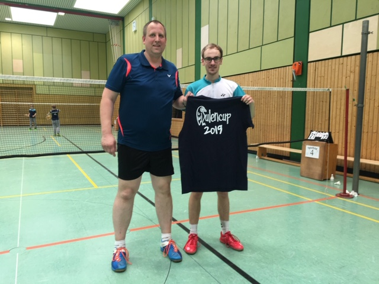

# Peiner Eulencup am 25. + 26.05.2019

Ein Landesmeistertitel geht nach Schaumburg, drei mal Vizemeister

Herrendoppel  Andreas Winter und Dominic Kirsten in Peine auf Platz 4

Am Sonntag, 25.05.2019 startete das Herrendoppel Andreas Winter/ Dominic Kirsten der VTRinteln in der D-Klasse beim  Peiner Eulencup. Insgesamt gingen knapp 30  Teilnehmer an den Start. 

Winter/ Kirstein belegten in der Vorrunde nach einer Niederlage und zwei Siegen Platz 2. Nach einem Sieg im Achtelfinale mussten sich die beiden im Viertelfinale gegen Ngoc Sang Ngo/ Oliver Fluthwedel vom SC Schwalbe behaupten und zogen mit einem deutlichen Zwei-Satz-Sieg ins Halbfinale ein.  Im Halbfinale gab es ein umkämpftes Match über drei Sätze gegen Andreas Niebuhr/ Alexander Wachtel (TSV Burgdorf), in dem die Rintelner Paarung schließlich mit 18:21 im dritten Satz das Nachsehen hatte. Im kleinen Finale um Platz drei reichte die Kraft nach den sechs vorhergehenden Spielen nicht mehr aus und Winter/ Kirstein erreichen nach einer Niederlage gegen Heß/ Heß ( VT Groß Ilsede) Platz 4.

