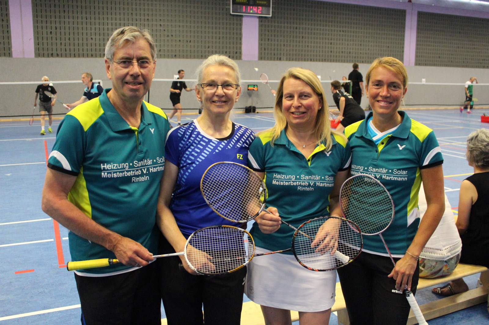

# Deutsche Meisterschaften O35 Badminton in Langenfeld

Vom 31.05. - 02.06. wurde in Langenfeld (Rheinland) die Deutsche Meisterschaft der Altersklasse im
Badminton ausgetragen. Aus Rinteln waren Bettina Krachudel, Walter und Doris Westermann und
Stefanie Battefeld am Start.

Bettina Krachudel trat im Damendoppel O50 an der Seite von Maren Nitz (Delmenhorster FC) an und
unterlag in Runde zwei der Paarung Pies/ Reffert (Sachsen-Anhalt/ Rheinhessen-Pfalz) mit 21:14/18.
Stefanie Battefeld war an der Seite ihrer Gifhorner Partnerin Jennifer Thiele im Doppel O40 am Start
und unterlag ebenfalls in Runde 2 der bayrischen Paarung Exl/ Kuske.

In der Altersklasse O65 verloren Doris Westermann und Angelika Peddinghaus (TSV Bad Eilsen) ihr
Auftaktspiel knapp gegen die top gesetzten Prax/ Regineri (Rheinland/ NRW). Im Herrendoppel
konnten sich Walter Westermann und Walter Beißner (TSV Bad Eilsen) zunächst gegen Schmitz/
Willems aus Hessen deutlich 21:4/9 durchsetzen, scheiterten danach im Viertelfinale knapp in drei
Sätzen an der sächsischen Paarung Behrens/ Blauhut.

Deutlich erfolgreicher verlief das Turnier für das Mixed Westermann/ Westermann. Nach einem
klaren Sieg in der ersten Runde konnten sich die Rintelner auch im Viertelfinale gegen die Paarung
Lienig/ Henke aus NRW behaupten. Im Halbfinale folgte die Niederlagen gegen die Favoriten
Sonnabend/ Frahm (Niedersachsen) und die „Westermänner“ erreichten somit Platz 3. Ein Platz, auf
den die beiden stolz sein können, denn bei einer Deutschen Meisterschaft auf dem Treppchen zu
stehen, sei ein tolles Gefühl, so Walter Westermann anschließend.

Die Rintelner Delegation hatte neben dem sportlichen Aspekt auch einen Blick auf die gesamte
Turnierorganisation, denn im kommenden Jahr werden die 33. Deutschen Meisterschaften der
Altersklasse in Rinteln ausgerichtet.