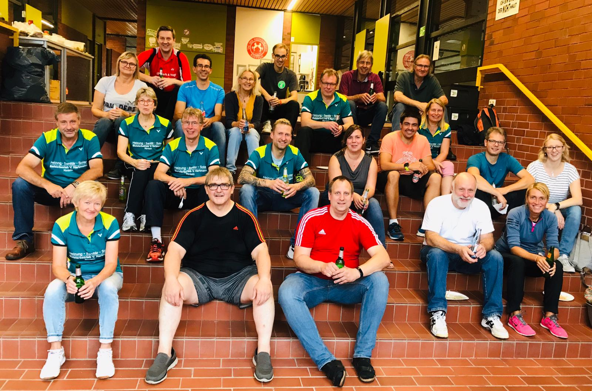

# 39. Rintelner Pokalturnier am 17./ 18.09.2019

Hochklassiges bundesweites Teilnehmerfeld mit 240 Spielern/-innen

Am Wochenende 17./18.08.2019 fand die 39. Auflage des Rintelner Pokalturniers in der Kreissporthalle statt. Aus ganz Deutschland reisten Badmintonspieler/ -innen an, um die Meister
in ihren Klassen zu ermitteln. Das Turnier startete am Samstag mit dem Mixed, in der C-Klasse ging die Rintelner Paarung Andreas Winter/ Nadine Reimann an den Start und gewann das Auftaktspiel gegen die Gifhorner Paarung März/ März. Anschließend folgten zwei Niederlagen und somit das Turnier-Aus. 

Bettina Krachudel (VTRinteln) und  Ramin Yousefi (MTV Nienburg) setzten sich in der B-Klasse in der Vorrunde durch in zwei von drei Spielen durch, schieden dennoch aus. 

In der A-Klasse siegten Robert Neumann (BSV Buxtehude) und Stefanie Battefeld (VTRinteln) zunächst zweimal u.a. gegen die Dresdener Regionalliga-Spielerin Melanie Keil an der Seite von Franz Pietschmann. Die Niederlage im dritten Spiel gegen Falco Bittner (TuS Dornberg) und die Bielefelderin Hannah Sudhölter beendete anschließend das Turnier.

Im Einzel war Dominic Kirstein der einzige Rintelner Teilnehmer. Leider erwischte Kirstein eine starke Vorrunde-Gruppe in der B-Klasse und musste zwei Niederlagen u.a. gegen den späteren Sieger Martin Möllmann (OSC Damme)  einstecken. 

Das Damendoppel Bettina Krachudel/ Maren Nitz (Delmenhorster FC) setzte sich in der Vorrunde durch, traf im Viertelfinale anschließend auf die späteren Sieger Jona Neubacher/ Jennifer Dreyer (TSV Limmer) und mussten sich dort geschlagen geben. 

Im Herrenoppel traten lediglich die Rintelner Dirk Spork/ Marko Rost an, verloren in der C-Klasse jedoch alle drei Vorrundenspiele. 

Das Orga-Team um Sven Aits und Andreas Winter war am Ende der zwei Turniertage äußerst zufrieden, viel positive Resonanz seitens der Spieler bestätigte dies. Das RiPo ist mittlerweile fast ein Selbstläufer, dennoch konnte das diesjährige Turnier  in vielen Bereichen als Generalprobe für die Deutsche Meisterschaft O35 im kommenden Jahr genutzt werden, die in Rinteln stattfinden wird. 

