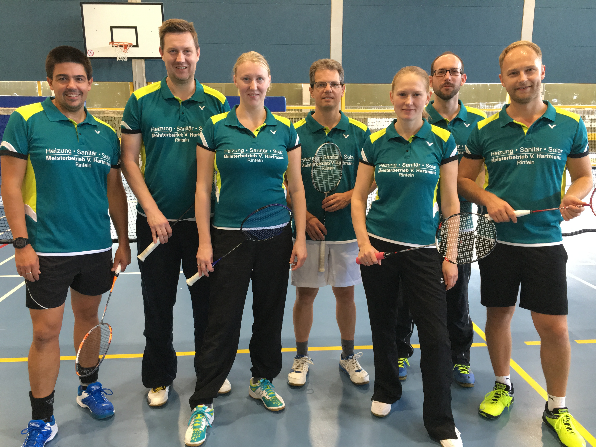

# Saisonauftakt Badminton 14./ 15.09.2019

Für die beiden Badmintonmannschaften der VTRinteln begann am Wochenende 14./ 15.09. die Saison.

Am Samstag startete die 1 Mannschaft um Sven Aits in der Bezirksliga Nord. Das Auftaktspiel gewannen die Rintelner in Top-Besetzung  mit 5:3. In der zweiten Begegnung trat die Mannschaft gegen sie SG Pennigsehl-Liebenau an. Das Spiel war von Anfang an hart umkämpft, das erste Herrendoppel  und das Damendoppel gingen an die Pennigsehler, das zweite Herrendoppel sowie das Mixed gingen an die Rintelner. Leider folgte aus den Einzeln nur ein Sieg, so dass es am Ende 3:5 gegen die Weserstädter hieß.

Am Sonntag folgte  das Auftaktspiel für die 2 Mannschaft der VTR in der Kreisliga gegen den BSC Stadthagen. Die Herrendoppel Wöbse/ Winter und Goetsch/ Kirstein siegten souverän, sämtliche Einzel gingen ebenfalls an die Rintelner. Auch das Mixed Winter/ Guse sigte, so dass am Ende ein deutlicher 7:1 Sieg stand.

In zwei Wochen finden die nächsten Punktspiele statt und es heißt weiter Daumen drücken für beide Mannschaften. 
