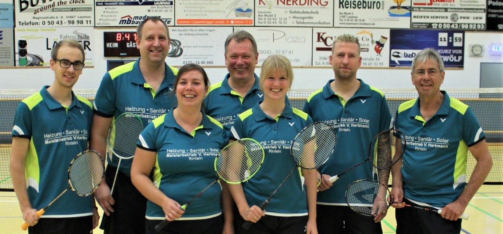

Zweites Punktspiel Kreisligamannschaft VT Rinteln-Badminton

Ein deutlicher Sieg – ein Unentschieden

Am 29.09.  startetet die 2. Mannschaft der VTR in die zweite Runde. Gegen den TSV Hagenburg I gelang den Rintelnern ein souveräner 7:1 Sieg. Lediglich Walter Westermann hatte in seinem Einzel im dritten Satz mit 20:22 das Nachsehen und verlor denkbar knapp.

In der zweiten Partie hieß der Gegner Viktoria Lauenau und das Spiel gestaltete sich spannend. Nach einer 2:0-Führung durch die Herrendoppel verloren das Damendoppel Hübert/ Guse sowie das Herreneinzel Kirstein. Das Herreneinzel Westermann ging an die VTR, das Herreneinzel Goetsch wiederum an Lauenau – Zwischenstand 3:3. Nadine Hübert verlor das Einzel, so dass es aus das Mixed ankam. Volker Furchbrich und Franziska Guse siegten souverän, so dass es am Ende 4:4 stand.

Anfang November geht es in die dritte Runde.
