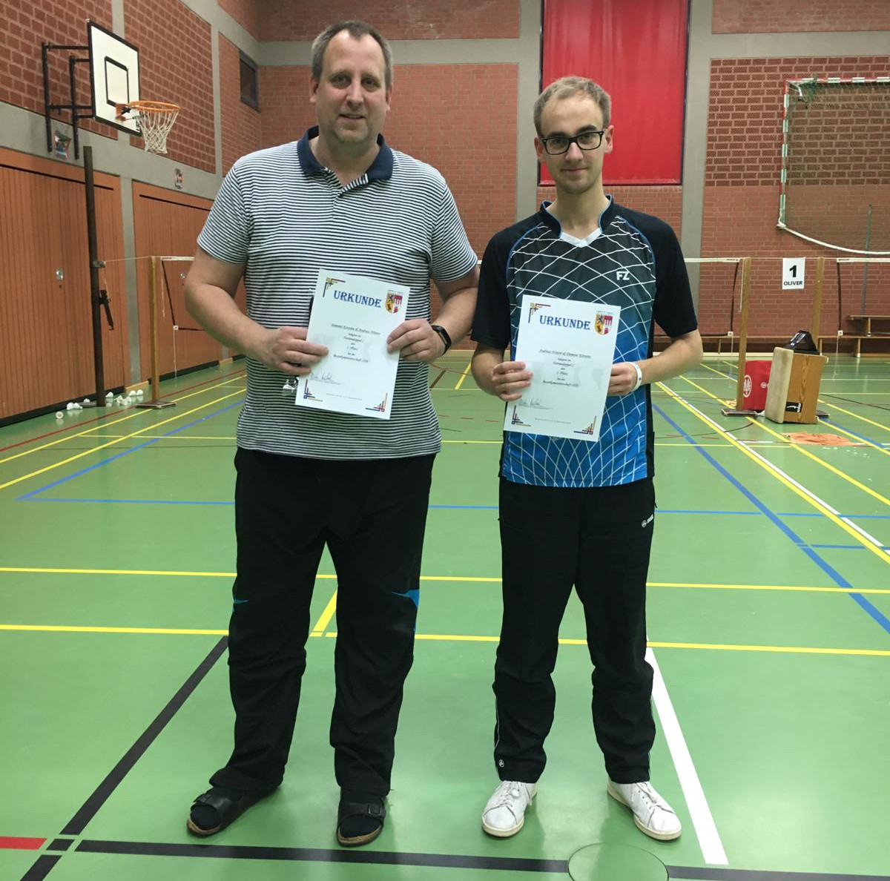

# Badminton-Bezirksmeisterschaften O 19 am 16./ 17.11.2019 in Nienburg

Erfolg für Doppel Winter/ Kirstein

Am Wochenende 16./17.11.2019 wurden in Nienburg die Bezirksmeisterschaften aufgetragen.

Aus Rinteln waren Dominic Kirstein im Einzel sowie im Doppel an der Seite von Andreas Winter am Start.

In der Einzelkonkurrenz musste Dominic Kirstein in der B-Klasse starten, dort verlor er das Auftaktspiel gegen den späteren Sieger Jan Wilewald (MTV Nienburg). Leider ging auch das zweite Spiel gegen Andrian Andritzky (FC Schwalbe) knapp mit 19:21/ 19:21 an den Gegner. Mit dem Sieg im abschließenden Einzel gegen Sven Hinzmann (ebenfalls FC Schwalbe) mit 21:14/13 sicherte sich Kirstein Rang 3.

Am Sonntag traten Kirstein/ Winter in der C-Klasse an, mit zwei souveränen Siegen gegen Lehmann/ Valdix (Hannover 96) 21:13/13 und gegen Gröger/ Petersen (SC Schwalbe) 21:19/15 sicherten sich die beiden den Meistertitel.