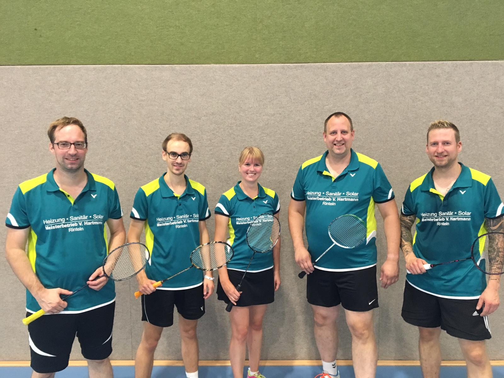

# Keine Erfolge am Punktspiel-Wochenende 23./24.11.2019

VT Rinteln II gibt Tabellenführung ab, VT Rinteln I gerät in den Abstiegskampf

Am vergangenen Wochenende starteten die beiden Rintelner Mannschaften in die nächste Runde. Die erste Mannschaft verlor mit 3:5 beim TV Bruchhausen-Vilsen das Herrendoppel Sven Aits/ Christian Schücke, das Damendoppel Stefanie Schrader/ Olga Koczewski und das Dameneinzel von Olga Koczewski sorgten für die drei Zähler auf Rintelner Seite.

Im ersten Spiel der Rückserie ging es gegen den Tabellenzweiten Hannover 96 II, hier kassierten die Rintelner eine 2:6 Niederlage und sind auf Tabellenplatz 6 abgerutscht. Gegen Hannover 96 II punkteten wieder das Damendoppel Stefanie Schrader/ Olga Koczewski sowie das Mixed Sven Aits/ Stefanie Schrader. 

Für die 2. Mannschaft ging es um die Tabellenführung. Gegen den direkten Verfolger SG Eilsen-Bückeburg/ Pyrmont IV war die Partie offen. Das Herrendoppel Andreas Winter/ Michael Wöbse siegte gegen Detlef Rieger/ Stefan Steinberg, Franziska Guse/ Nadine Hübert gaben das Damendoppel gegen Stefanie Soika/ Ute Windheim ab. Dominic Kirstein und Walter Westermann siegten gegen Jörn Schmidt/ Christian Hoffmann im 2. Herrendoppel. Das Damendoppel von Brigitte Brakemeier ging an die Gegner, das Mixed Andreas Winter/ Franziska Guse an die Rintelner. Aus den Herreneinzeln holten die Rintelner abschließend nur einen Punkt von Dominic Kirstein, Michael Wöbse und Marcel Goetsch blieben sieglos, am Ende stand es 4:4 in der Begegnung.

Das zweite Spiel gegen Victoria Lauenau startete vielversprechend, alle drei Doppel gingen an die VT Rinteln. Walter Westermann gegen Sven Wehrhahn und Dominic Kirstein gegen Mathias Sachau blieben im Einzel sieglos, ebenso Brigitte Brakemeier im Einzel. Marcel Goetsch konnte das 3. Herreneinzel gegen Björn Freier für sich entscheiden. Im abschließenden Mixed hatte Andreas Winter und Nadine Hübert den Sieg in der Hand und zwischendurch sogar einen Matchball. Dennoch ging der Sieg an die Lauenauer – Endstand 4:4. Damit ist die VT Rinteln II Tabellenzweiter hinter der SG Eilsen-Bückeburg/ Pyrmont.