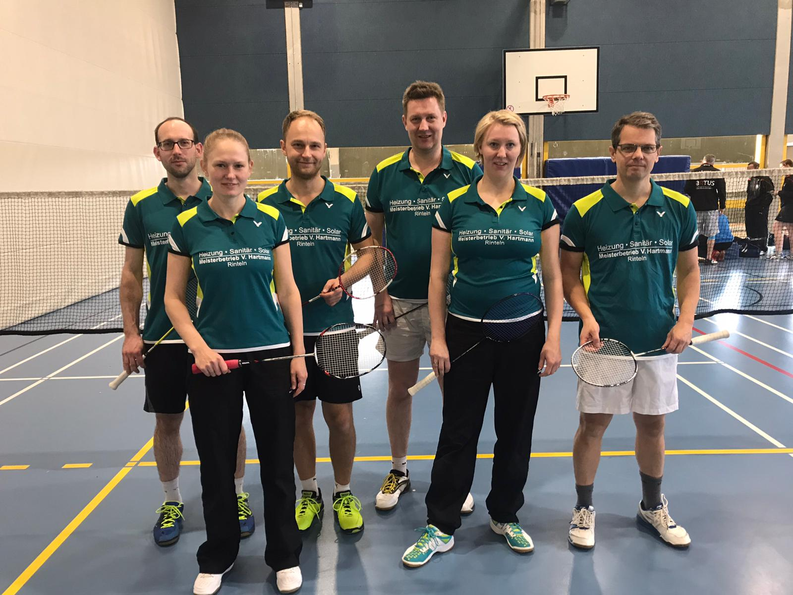

# Erfolgreicher Punktspieltag am 14.12.2019

Sowohl die erste als auch die zweite Mannschaft gewinnen ihre Spiele.

Die VTRinteln 1 gewann die letzten Punktspiele des Jahres in der Bezirksliga Hannover mit jeweils 5:3 und hat sich somit im Tabellenmittelfeld Luft verschafft.

Gegen den SSV Langenhagen siegten das Herrendoppel Björn Eilert/Stephan Rinne gegen Uffe Vajhoj/ Tobias von Janta 16:21, 21:17, 22 :20 sowie das Damendoppel Olga Koczewski/ Stefanie Schrader 21:14, 21:13 gegen Jessica Schanze/ Annika Vajhoj. Olga Kozcewski gewann das 
Einzel gegen Jessica Schanze in einem umkämpften Spiel 18:21, 22:20, 21:18. Stephan Rinne siegte gegen Tobias von Janta 21:7, 21:16. Sven Aits/ Stefanie Schrader holten im Mixed gegen Oskar Koch/ Petra Hundeshagen 21:11, 21:12 den Siegpunkt. 

Im zweiten Spiel gegen den SC Langenhagen kam zunächst nur ein Punkt aus den Doppeln, Sven Aits/ Christian Schücke siegten gegen Sören Böhlmann/ Dennis Labahn 21:10, 19:21, 21:19. Olga Koczewski holte den zweiten Punkt gegen Annika Staats. In den Herreneinzeln siegten Börn Eilert deutlich gegen Oliver Kornatz 21:4, 21:8 und Christian Schücke gegen Sören Böhlmann 21:19, 21:16.
Den Punkt zum 5:3 Endstand sicherte sich das weiterhin ungeschlagene Mixed Sven Aits/ Stefanie Schrader gegen Dennis Labahn/ Katrin Engler 22:20, 21:16 . Damit geht die VTRinteln 1 auf dem fünften Tabellenplatz in die Weihnachtspause. 

Die Reserve der VTRinteln ging ebenfalls zweimal siegreich aus ihren Spielen. Gegen den TV Hemeringen siegten die Doppel Dominic Kirstein/ Andreas Winter und Franziska Guse/ Nadine Hübert. Die Einzel von Nadine Hübert, Dominic Kirstein, Walter Westermann und Marcel Goetsch gingen ebenfalls an die Rintelner. Im abschließenden Mixed siegten Andreas Winter und Franziska Guse, Endstand 7:1. In der zweiten Begegnung gegen die BSC Stadthagen gingen alle Spiele an die Rintelner, die damit als direkter Verfolger der SG Eilsen/Bückeburg-Bad Pyrmont auf Platz zwei der Kreisligatabelle bleiben.