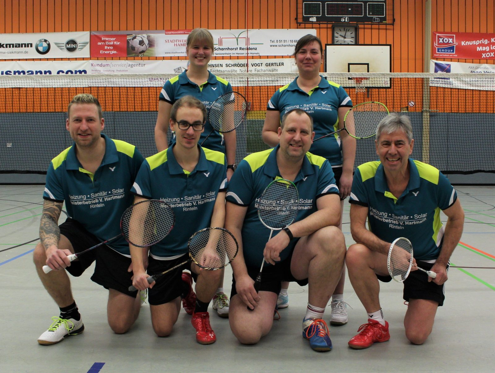

# Gelungener Start ins Jahr 2020 – Punktspiele der 2. Mannschaft am 19.01.2020

Die zweite Mannschaft der VTR startete am 19.01. ins neue Jahr. Zwei deutliche Siege
sichern der Mannschaft um Andreas Winter vorerst die Tabellenführung in der Kreisliga.

In der ersten Begegnung besiegten die Rintelner den Vfl Hameln 2 mit 7:1, dabei musste sich lediglich Marcel Goetsch seinem Einzelgegner Udo Hagemann knapp geschlagen geben.  Im darauffolgenden Spiel gegen den VfL Hameln 3 stand es am Ende ebenfalls 7:1 für die VTR, Walter Westermann musste sein Spiel nach einem deutlich gewonnenen ersten Satz verletzungsbedingt aufgeben.

Am 15. Februar geht es für die Rintelner um den Aufstieg in die Bezirksklasse, Franziska Guse, Nadine Hübert und die Herren Andreas Winter, Dominic Kirstein, Marcel Goetsch, Volker Furchbrich und Walter Westermann blicken zuversichtlich auf den letzten Spieltag.