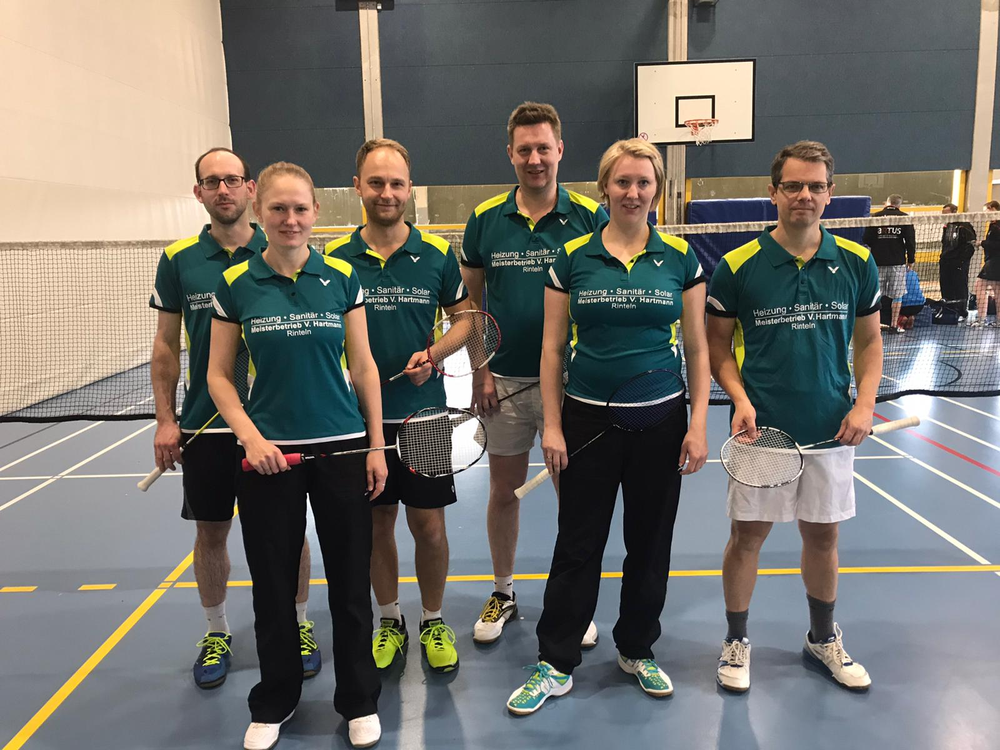

# Erfolgreiches Punktspielwochenende

Am 26. Januar startete auch die erste Mannschaft der VTRinteln in das Jahr 2020.

Gegen den TuS Wunstorf gelang den Rintelnern ein 5:3-Sieg. Die Punkte holten dabei das Danendoppel Stefanie Schrader/ Olga Koczewski sowie die Herrendoppel Sven Aits/ Christian Schücke und Dominic Kirstein/ Björn Eilert. Im Mixed siegten Sven Aits und Stefanie Schrader, den Siegpunkt sicherte Christian Schücke in einem hart umkämpften Einzel. Olga Koczewski, Björn Eilert und Dominic Kirstein, der als Ersatz eingesprungen war, mussten sich den Gegnern aus Wunstorf geschlagen geben. Mit dem Sieg festigt die VTRinteln Platz 5 in der Bezirksliga. 

Der letzte Punktspieltag findet am 16. Februar in Rinteln statt.