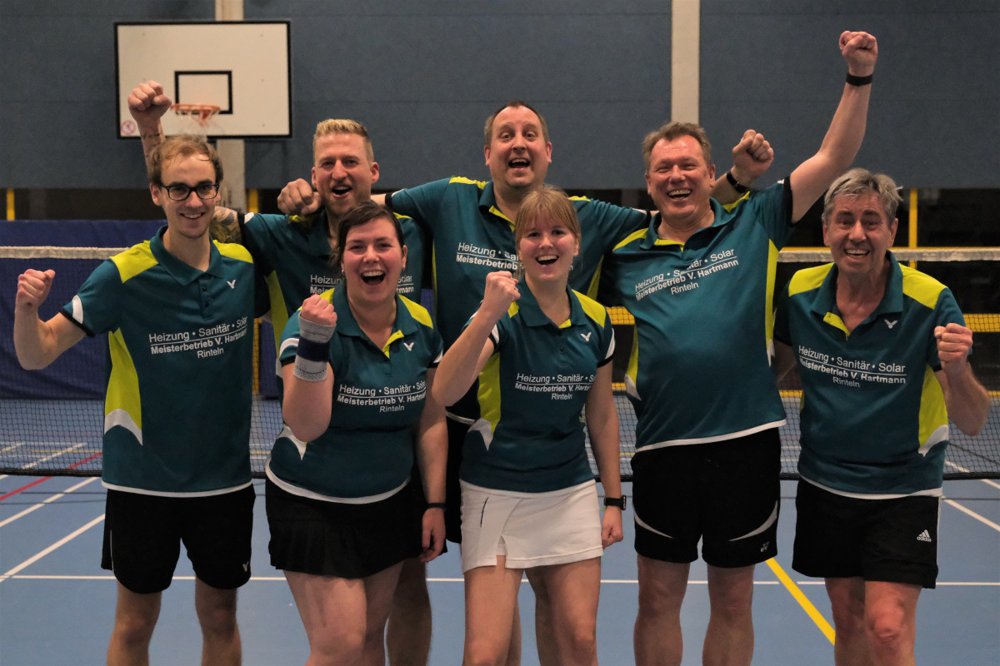

# Saison-Finale – Zweite Mannschaft der VT Rinteln steigt in die Bezirksklasse auf

Am vergangenen Wochenende stieg das Saison-Finale der beiden Rintelner Mannschaften mit Heimspielen in der Kreissporthalle. Die zweite Mannschaft zeigte eine souveräne Leistung und steigt nach zwei weiteren Siegen in die Bezirksklasse auf.

In der ersten Begegnung traten die Rintelner gegen des TSV Hagenburg an und gewannen 8:0. 

In der letzten Begegnung der Saison 2019/ 2020 hieß der Gegner SG Eilsen/ Bückeburg/ Bad Pyrmont 4 – der direkte Verfolger in der Tabelle. Die Herrendoppel Marcel Goetsch/ Dominic Kristen und Andreas Winter/ Volker Furchbrich gewannen ebenso wie das Damendoppel Franziska Guse/ Nadine Hübert. Dominic Kirstein gewann anschließend auch sein Einzel gegen Reinhard Timm 21:10/18, Walter Westermann gewann gegen Stefan Steinberg 21:19/18 und Andreas Winter setze sich 21:10/18 gegen Detlef Rieger durch. Nadine Hübert musst das Dameneinzel verletzungsbedingt aufgeben. Das abschließende Mixed gewannen Volker Furchbrich und Franziska Guse gegen Peter und Tanja Gaßmann 21:19, 22:20. Die VT Rinteln sicherte sich mit diesem Sieg den Aufstieg - Herzlichen Glückwunsch !!

Für die erste Mannschaft der VT Rinteln ging es am Wochenende zuhause zunächst gegen den TV Bruchhausen-Vilsen. Mit einem 6:2-Sieg konnte die Mannschaft sehr zufrieden sein. In der anschließenden Begegnung gegen die bereits als Aufsteiger feststehende SG Pennigsehl/ Liebenau gingen die Rintelner mit Siegen im Herrendoppel Sven Aits/ Christian Schücke und im Damendoppel Stefanie Schrader/ Olga Koczewski in Führung. Das Herrendoppel Björn Eilert/ Dominic Kirstein verlor im Anschluss. Olga Koczweski verlor das Einzel knapp in drei Sätzen. Björn Eilert konnte sein Einzel für sich entscheiden, die Einzel von Christian Schücke und Dominic Kirstein gingen an die Gäste aus Pennigsehl. Mit einem Sieg im abschließenden Mixed korrigierten Fabian Korte und Stefanie Schrader das Ergebnis auch 3:5. Mit Tabellenplatz vier können die Rintelner am Ende der Saison zufrieden sein.