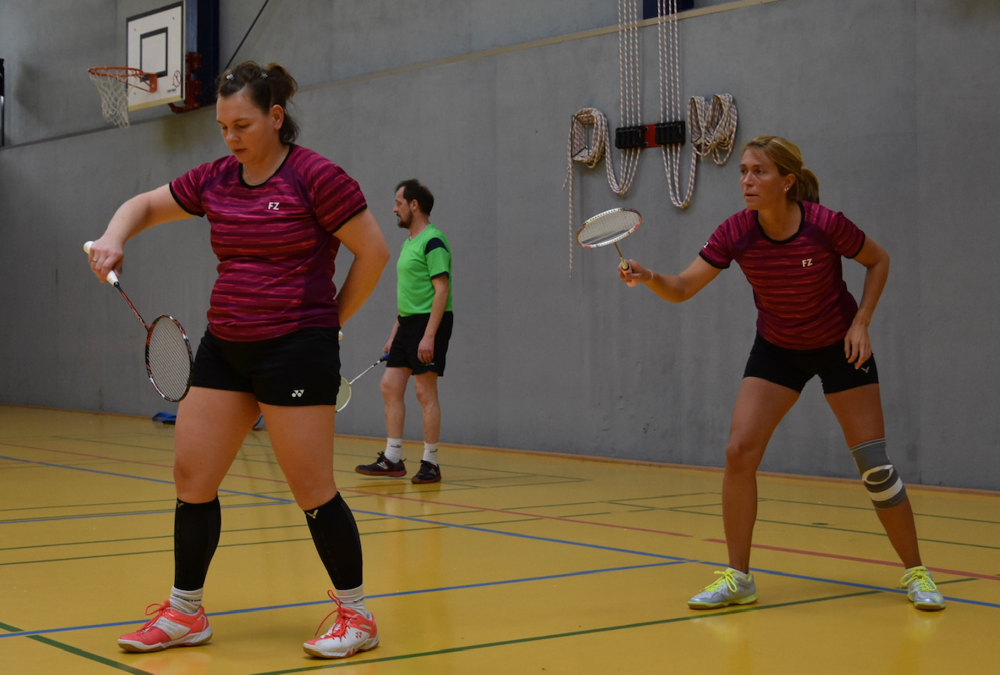
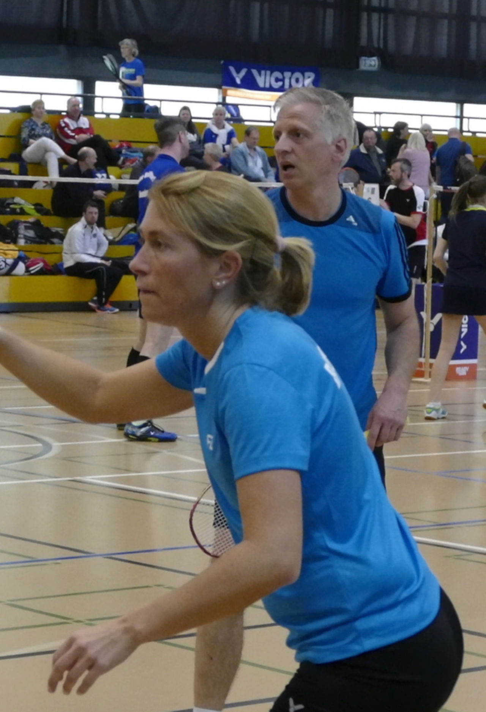
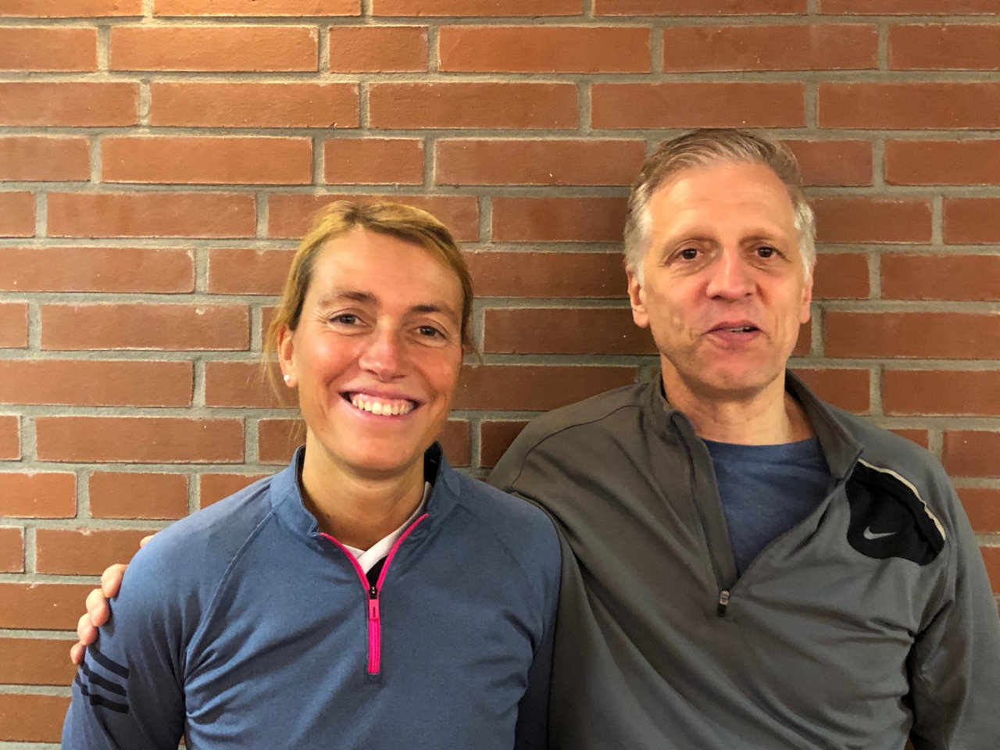
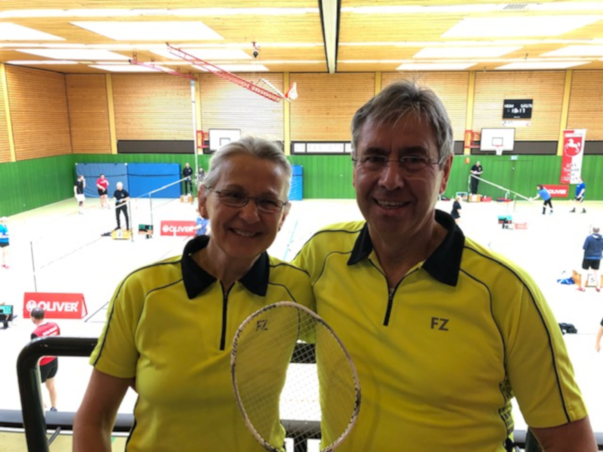
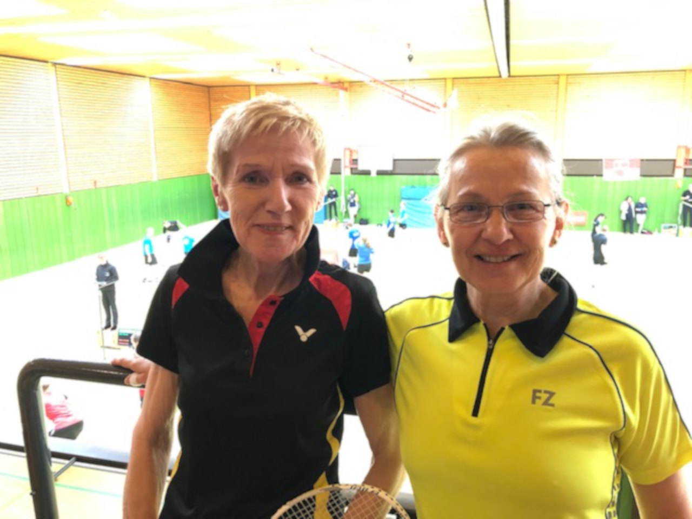
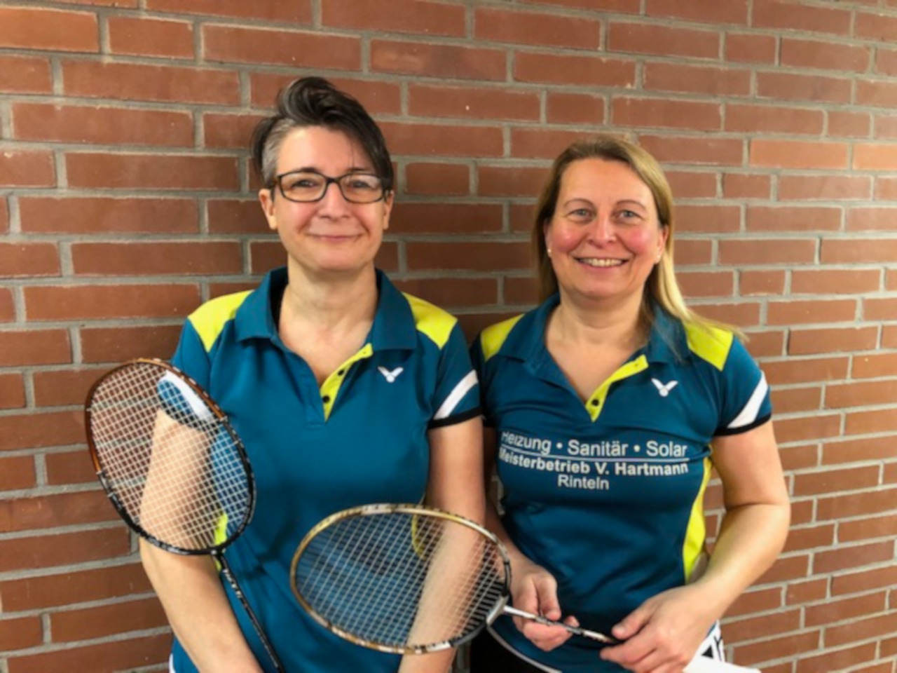
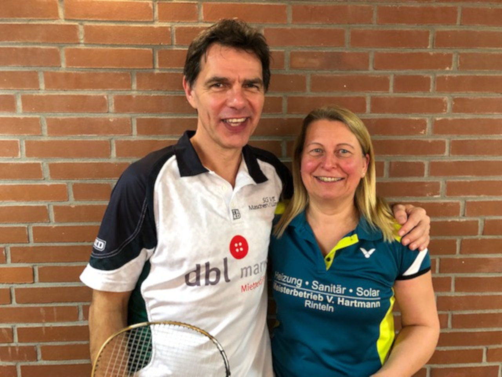
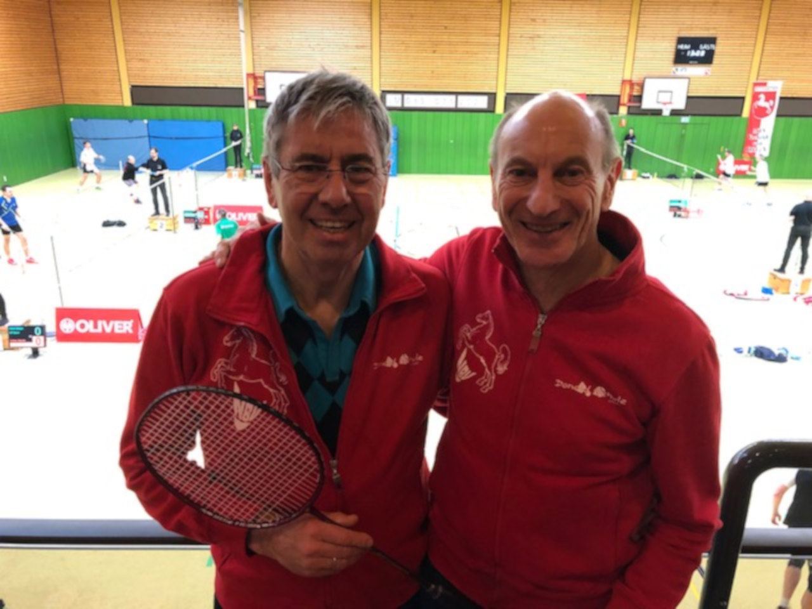
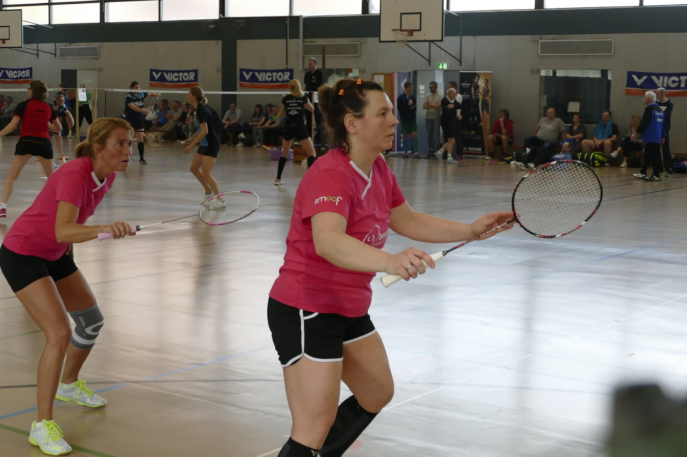

# Erfolgereiche Bilanz der  Landesmeisterschaften O35 am 22./23.02.2020

Zwei Landesmeistertitel – zwei Vizemeister für die VT Rinteln – vier Bronzemedaillen

Das erste Qualifikationsturnier für die in diesem Jahr in Rinteln stattfindende Deutsche Meisterschaft O35 ist Geschichte –  eine überaus erfolgreiche Geschichte. Die Vertreter der VT Rinteln kehrten mit reichlich Medaillen von den Landesmeisterschaften in Vechelde zurück.

In der Altersklasse O40 wurde Stefanie Battefeld im Mixed an der Seite von Robert Neumann (Buxtehuder SV) nach einem engen Endspiel gegen Henning Zansen und Martina Götz Vizemeister. Im Damendoppel setzten sich Stefanie Battefeld und Jennifer Thiele (BV Gifhorn) in einer 5er-Gruppe durch und wurden Landesmeisterinnen.

Im Damendoppel der Altersklasse O50 mussten sich Bettina Krachudel und Maren Nitz (SC Wildeshausen) nur im Finale der Paarung Heike und Karen Laubvogel (TuS Wettbergen) geschlagen geben und sicherten sich die Silbermedaille.

Bettina Krachudel wurde im Dameneinzel der Klasse O55 Dritte, diese Platzierung erreichte Krachudel mit Ihrem Partner Frank Schmahl vom VfL Lüneburg.

Im Halbfinale der Altersklasse O65 scheiterte Walter Westermann an seinem Doppelpartner Walter Beißner. Ebenfalls im Halbfinale (an der Seite seiner Frau Doris) und ebenfalls gegen Walter Beißner (an der Seite von Angelika Peddinghaus) scheiterte Westermann im gemischten Doppel. Kein Grund zur Enttäuschung, denn anschließend sicherten sich Westermann/ Beißner im Herrendoppel gemeinsam den Landesmeistertitel. Doris Westermann belegte in der gleichen Altersklasse zusammen mit Angelika Peddinghaus Platz 2.

Alle Rintelner haben sich damit für die im April in Buchholz in der Nordheide stattfindenden Norddeutschen Meisterschaften qualifiziert. Herzlichen Glückwunsch !!

